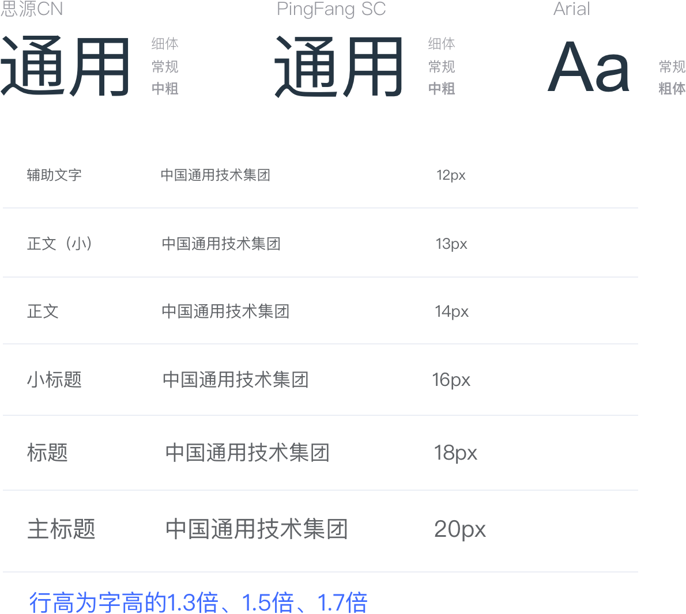

### Color 色彩

为了避免视觉传达差异，使用一套特定的调色板来规定颜色，为你所搭建的产品提供一致的外观视觉感受。

#### 主色

主要品牌颜色是通用蓝。

    
Brand Color
        
#406CFF

        

        

        

    

#### 辅助色

除了主色外的场景色，需要在不同的场景中使用（例如危险色表示危险的操作）。

    

        
Success
#67C239

        
Danger
#E76060

        
Warning
#E6A23C

        
Info
#909399

    

#### 中性色

中性色用于文本、背景和边框颜色。通过运用不同的中性色，来表现层次结构。

    

        

            
主要文字
#303133

            
常规文字
#606266

            
次要文字
#909399

            
占位文字
#C0C4CC

        

    

        

            
一级边框
#DCDFE6

            
二级边框
#E4E7ED

            
三级边框
#EBEEF5

            
四级边框
#F2F6FC

        

    

        

            
基础黑色
#000000

            
基础白色
#FFFFFF

            
透明
Transparent

        

    

### Font 字体

<!--  -->

